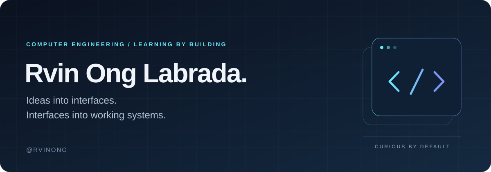

  

  <a href="#selected-work">Selected work</a> &nbsp; / &nbsp;
  <a href="#toolbox">Toolbox</a> &nbsp; / &nbsp;
  <a href="#currently-exploring">Currently exploring</a>

## Hey, I'm Rvin.

I'm a **Computer Engineering student** who likes turning ideas into things people can actually use. I build across the frontend, backend, and database, with a particular interest in student communities, useful web tools, and interfaces that feel good on a phone.

**Seeing how far vibe coding can take me.** I use AI as part of my process, then learn through the details: tracing the logic, testing the flow, fixing what breaks, and understanding why a solution works.

Right now, much of that learning happens through **ICpEP Connect**, an organization website that brings content, community, and member services together.

## Selected work

### 01 / ICpEP Connect

**A digital home for a Computer Engineering community.**

An organization portal bringing together announcements, events, news, galleries, alumni profiles, and a community chat. Member accounts, role-based admin tools, and merchandise ordering connect the public website to the work happening behind it.

`React` `Vite` `Tailwind CSS` `Framer Motion` `Supabase`

[Explore the website](https://cpe-website-two.vercel.app) &nbsp; / &nbsp; [View the code](https://github.com/rvinong/cpe-website)

---

### 02 / CPE-HUB

**Learning full-stack development through ecommerce.**

A project connecting storefront pages with backend routes, authentication, product data, and admin/user workflows. It is where I practice how the interface, API, and database fit together as one application.

`React` `Tailwind CSS` `Express.js` `MongoDB` `Mongoose` `JWT`

[View the code](https://github.com/rvinong/CPE-HUB)

---

### Smaller builds, different lessons

- **[mco-linkedlist](https://github.com/rvinong/mco-linkedlist)**: exploring linked lists and data structure logic with JavaScript, HTML, and CSS.
- **[Ether-Web-Innovations](https://github.com/rvinong/Ether-Web-Innovations)**: experimenting with frontend layout, styling, and web presentation.

## Toolbox

The tools I use and the fundamentals I'm continuing to develop:

| Area | Technologies |
| :--- | :--- |
| Interfaces | React, HTML, CSS, Tailwind CSS, Framer Motion |
| Application logic | JavaScript, Node.js, Express.js, React Router |
| Data and accounts | Supabase, MongoDB, Mongoose, JWT |
| Development and deployment | Git, GitHub, Vite, Vercel, VS Code |
| Programming fundamentals | C, C++, Python, JavaScript |

## Currently exploring

- **Better mobile experiences.** Clear layouts, comfortable controls, and less friction on smaller screens.
- **The full journey through an app.** How authentication, permissions, database operations, and UI states work together.
- **Maintainable projects.** Making code easier to follow as features and real users grow.
- **Stronger fundamentals.** Connecting what I build with the programming concepts behind it.

---

  <strong>Build something. Understand it. Make it better.</strong> 
  A work in progress, just like the projects.

